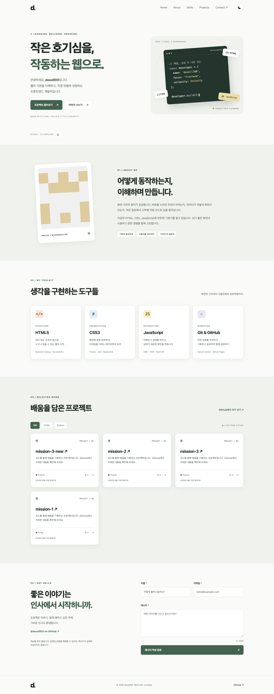
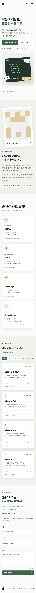
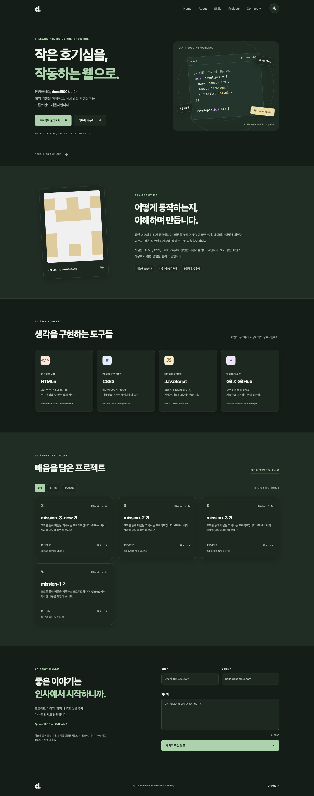

# dooolll00 — 순수 웹 포트폴리오

HTML, CSS, JavaScript만으로 구현한 반응형 포트폴리오입니다. **이벤트 → 상태 변경 → DOM 렌더링** 흐름을 테마, 메뉴, GitHub 프로젝트, 문의 폼에서 직접 확인할 수 있습니다.

## 실행

1. VS Code에서 이 `portfolio` 폴더를 엽니다.
2. 확장 탭에서 추천 확장 **Live Server (ritwickdey.LiveServer)** 를 설치합니다.
3. `index.html`에서 우클릭 → **Open with Live Server**.
4. `http://127.0.0.1:5500`에 접속합니다.

현재 개발 환경에는 Live Server 설치를 완료했습니다. 설정 파일 `.vscode/extensions.json`, `.vscode/settings.json`을 포함했습니다. npm 설치나 빌드 과정은 필요하지 않습니다. 대안으로 `python3 -m http.server 5500 --bind 127.0.0.1`을 실행해 같은 주소에서 볼 수 있습니다. 파일을 직접 더블클릭하기보다 HTTP 개발 서버 사용을 권장합니다. 같은 포트를 사용하는 서버는 하나만 실행하세요.

## 파일 구조

```text
portfolio/
├── index.html                 # 시맨틱 구조, 폼과 기본 콘텐츠
├── css/style.css              # 모바일 퍼스트, CSS 변수, 테마, 애니메이션
├── js/main.js                 # 상태, 이벤트, 렌더링, API
├── images/
│   ├── profile.png            # 본인 GitHub 프로필 아바타
│   ├── favicon.svg
│   └── screenshots/           # 실제 브라우저 캡처 3종
├── .vscode/                   # Live Server 추천 및 설정
├── .nojekyll                  # GitHub Pages 정적 배포용
└── README.md
```

## 구현 기능

- Hero, About, Skills, Projects, Contact, Footer와 각 섹션의 앵커 링크.
- 768px 미만 모바일 메뉴, 768px 태블릿, 1024px 데스크톱 레이아웃.
- 햄버거 열기/닫기, 링크 선택·외부 클릭·Escape·화면 크기 변경 시 닫기.
- 부드러운 스크롤과 대상 포커스 이동, 본문 건너뛰기 링크.
- **60px 이상** 스크롤 시 헤더 배경 변경, **300px 이상**에서 맨 위 버튼 표시.
- 다크 모드와 `localStorage` 저장. 최초 방문 시 시스템 테마를 따르며, 직접 선택하기 전까지 시스템 테마 변경에도 반응.
- Intersection Observer **threshold: 0.2**. 요소가 20% 보이면 한 번 등장. Observer가 없거나 동작 줄이기 설정이면 내용을 바로 표시.
- `prefers-reduced-motion` 사용자는 부드러운 이동과 애니메이션을 생략.
- GitHub 공개 저장소 조회, 언어별 필터, 별·포크 수·업데이트 날짜.
- API 로딩/성공/에러/빈 상태, 재시도 버튼, 15초 요청 제한시간.
- 이름·이메일·메시지 필수 검증, 공백 입력 방지, 이메일 형식 검증, 필드별 오류, 첫 오류로 포커스 이동, 메시지 글자 수.
- 사용자 입력과 외부 API 문자열을 안전하게 렌더링. 외부 저장소 링크는 HTTPS GitHub 주소만 허용.

문의 폼은 **학습용 검증 데모**입니다. 제출 이벤트에서 기본 이동을 막고 성공 메시지를 표시하며, 실제 이메일을 보내거나 입력 내용을 저장하지 않습니다. 실제 전송은 선택 과제로 남겨두었습니다. 소개 문구는 수정 가능한 학습용 초안이며, 실명이나 경력은 가정하지 않았습니다.

## GitHub API

`js/main.js`의 `GITHUB_USERNAME = "dooolll00"`에 연결된 본인 계정을 설정했습니다. 계정을 변경할 때 HTML의 프로필·소셜 링크와 이미지도 함께 수정하세요.

```text
https://api.github.com/users/dooolll00/repos?sort=updated&per_page=100&page=1
```

`fetch`와 `async/await`로 조회하며 100개를 초과하면 다음 페이지를 불러옵니다. 인증 토큰을 사용하지 않습니다. 공개 저장소 전체가 대상이며 fork 저장소도 포함합니다. 언어가 없으면 `기타`로 분류합니다.

반복 새로고침 시 요청을 줄이기 위해 성공 응답을 **5분간 localStorage 캐시**에 저장합니다. 에러는 캐시하지 않으며 재시도는 캐시를 건너뜁니다. 캐시가 손상되거나 브라우저 저장소가 차단되어도 조회할 수 있습니다. GitHub의 비인증 요청은 일반적으로 IP당 시간당 60회로 제한되며, 403/429 응답은 제한 안내와 재시도 UI로 표시합니다. 최신 저장소를 바로 확인하려면 개발자 도구에서 `portfolio-repos-dooolll00` 키를 삭제하거나 5분 뒤 새로고침하세요.

## 학습 포인트

### 시맨틱 HTML

`header`는 사이트 상단, `nav`는 주요 이동 링크, `main`은 본문, `section`은 제목을 가진 주제 단위, `article`은 독립적으로 이해 가능한 기술·프로젝트 카드, `footer`는 저작권과 소셜 링크에 사용했습니다. 구조를 설명하는 태그이므로 보조 기술과 개발자가 페이지의 역할을 파악하기 쉽습니다. 단순 배치 묶음에만 `div`를 사용했습니다. 이미지의 `alt`, 폼의 `label for`와 `id`, 상태 안내의 `aria-live`도 연결했습니다.

### Flexbox와 Grid

Flexbox는 한 축에서 항목을 배치하기 좋습니다. 네비게이션에서 로고·메뉴·버튼을 한 줄로 정렬하고, 버튼 묶음과 카드 메타데이터에도 사용했습니다. Grid는 행과 열을 함께 설계하기 좋습니다. 프로젝트 목록은 `repeat(auto-fit, minmax(min(100%, 290px), 1fr))`로 가용 너비에 따라 열 수를 자동으로 바꿉니다. 좁은 모바일에서도 최소 카드 너비가 화면을 넘지 않습니다.

### DOM과 이벤트

`querySelector`는 첫 요소, `querySelectorAll`은 일치하는 요소 목록을 선택합니다. 선택한 버튼에 `addEventListener("click", ...)`을 연결하고 상태를 바꾼 뒤 렌더링 함수를 호출합니다. `textContent`는 텍스트 안내에, `innerHTML`은 이스케이프한 카드 템플릿에 사용합니다. 클래스는 `classList.add/remove/toggle`로 관리합니다. HTML에 `onclick`이나 인라인 `style`은 없습니다.

### 상태 → 화면

| 이벤트 | 변경되는 상태 | 화면 업데이트 |
| --- | --- | --- |
| 테마 버튼 클릭 | `state.theme` | `renderTheme()` → `data-theme`, 버튼 레이블 |
| 메뉴 버튼 클릭 | `state.menuOpen` | `renderMenu()` → `active`, `aria-expanded` |
| API 요청 시작/완료/실패 | `state.projects.status` | `renderProjects()` → 로딩/카드/에러/빈 결과 |
| 언어 필터 클릭 | `state.projects.filter` | `filter()` 후 카드 렌더링, 선택 버튼 표시 |
| 폼 입력/blur/submit | `state.form.values/errors/success` | `renderForm()` → 오류·글자 수·성공 안내 |

상태는 화면이 기억해야 할 정보입니다. 이벤트 함수는 상태를 변경하고, 렌더링 함수는 상태를 DOM에 반영합니다. 이 구분이 React의 상태와 렌더링을 학습하는 기반이 됩니다. 폼은 처음부터 오류를 표시하지 않고 필드를 떠났거나 제출한 뒤 검사합니다.

### ES6+와 비동기

- 화살표 함수: 이벤트 콜백·렌더링 함수 등을 간결하게 정의합니다.
- 구조분해 할당: `const { status, repos, filter, error } = state.projects` 및 저장소 필드를 추출합니다.
- 템플릿 리터럴: `${...}`로 카드 HTML과 API 주소를 생성합니다.
- `map`: 저장소 객체 목록을 HTML 문자열 목록으로 바꿉니다.
- `filter`: 선택한 언어와 일치하는 저장소만 남깁니다.
- `forEach`: 각 링크·필드·관찰 대상에 필요한 처리를 수행합니다.
- `async/await`: 요청을 기다리는 동안 화면과 버튼을 계속 사용할 수 있습니다. 먼저 로딩을 렌더링하고 응답 후 성공 상태로 바꿉니다. `response.ok`를 검사해야 HTTP 403 같은 응답도 실패로 처리할 수 있습니다. `catch`에서 에러를 저장하고 `finally`에서 타이머를 정리한 후 최종 상태를 렌더링합니다.

## 검증

웹사이트는 순수 HTML/CSS/JavaScript로 동작합니다. 제출 전 별도 개발 환경에서 Chrome 자동 검증을 실행했습니다. Python 검증 도구와 의존성은 제출물에 포함하지 않습니다.

검증 범위: 320/375/768/1024/1440px 가로 넘침, 모바일 메뉴, 키보드 Escape 및 앵커 포커스, 테마 새로고침 유지, 시스템 테마 변경, 필수/공백/이메일 검증, 입력 수정 시 성공 안내 초기화, 스크롤 버튼과 헤더, 언어 필터, 외부 HTML/URL 주입 방지, API 로딩/빈 결과/403/404/500/네트워크 오류/잘못된 응답/재시도/페이지네이션, 저장소 차단, 캐시, 실제 GitHub 데이터.

위 자동 검증은 모두 통과했습니다. 추가로 동작 줄이기를 끈 Chrome에서 실제 Intersection Observer 등장 처리와 인라인 스타일·인라인 이벤트 부재, 이미지 alt를 확인했습니다.

## 스크린샷

실제 GitHub API 응답을 이용한 로컬 Chrome 캡처입니다.

| 데스크톱 · 1440px | 모바일 · 375px | 다크 모드 · 1440px |
| --- | --- | --- |
|  |  |  |

## 제출 및 배포 상태

- 업로드 대상 저장소: [dooolll00/B1-1](https://github.com/dooolll00/B1-1)
- 제출 파일: 검토를 마친 HTML/CSS/JavaScript, 이미지, README와 개발 설정 13개.
- 업로드 브랜치: `main`. 불필요한 개발용 테스트 파일을 제외한 제출본입니다.
- GitHub Pages: 아직 배포되지 않았으며, 접속 가능한 배포 URL은 없습니다.

배포할 때 Settings → Pages → Deploy from a branch → `main`의 `/ (root)`를 선택합니다. 저장소 하위 경로에서도 작동하도록 로컬 리소스를 상대 경로로 연결했습니다.

## 미션 요구사항 검토

| 항목 | 결과 |
| --- | --- |
| HTML/CSS/JS 역할 분리, 이미지 폴더, Live Server | 완료 |
| 시맨틱 태그, 6개 섹션, 앵커, 이미지 alt, 폼 label | 완료 |
| CSS 변수, Flexbox/Grid, 768/1024px, hover/transition/shadow | 완료 |
| defer, const/let, DOM 선택과 변경, click/submit/scroll/input | 완료 |
| 모바일 메뉴, 부드러운 스크롤, 맨 위 버튼, 헤더 변경 | 완료 |
| 다크 모드와 저장, Intersection Observer 0.2 | 완료 |
| 필수값·공백·이메일 검증, 필드별 오류, 성공 안내 | 완료 |
| 화살표 함수, 템플릿 리터럴, 구조분해, map/filter/forEach | 완료 |
| 실제 GitHub API, 로딩/성공/에러/빈 상태, 403 및 재시도 | 완료 |
| 3개 이상 상태 → 렌더링 흐름 | 완료 (테마/메뉴/API/필터/폼) |
| README 설명·사용 기술·스크린샷 3종 | 완료 |
| GitHub 제출 파일 및 GitHub Pages 공개 URL | GitHub 제출본; Pages 배포 미완료 |
| 선택 과제 | 언어 필터와 시스템 테마 감지 구현; 타이핑·실제 이메일 전송 미구현 |

제출물에는 사이트 소스, 필요한 이미지, 필수 스크린샷, README, Live Server 설정, 정적 배포 설정만 남겼습니다.
